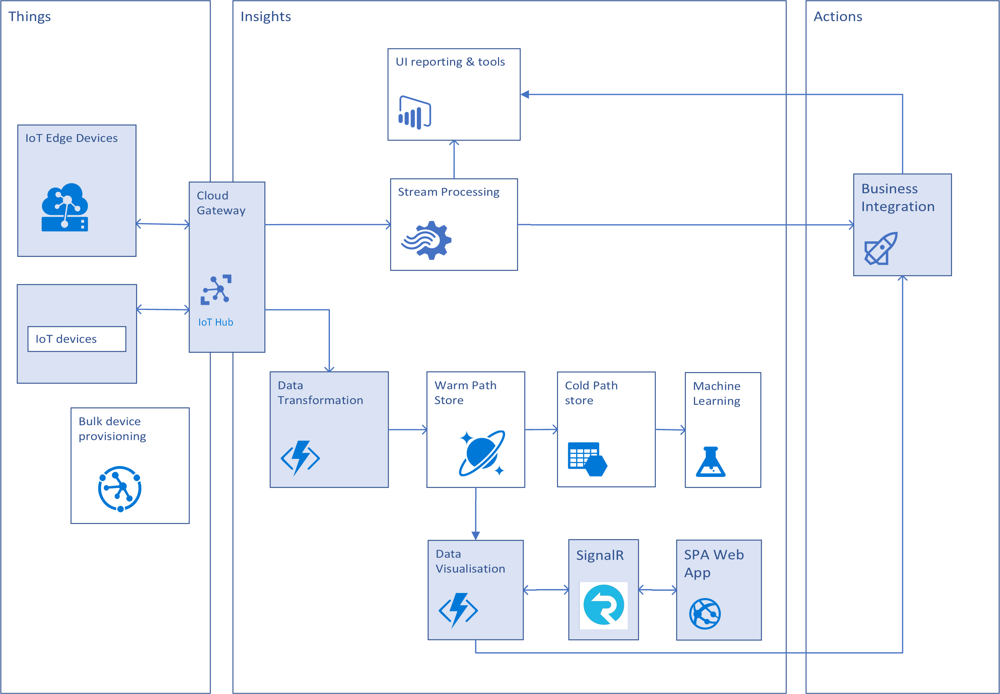
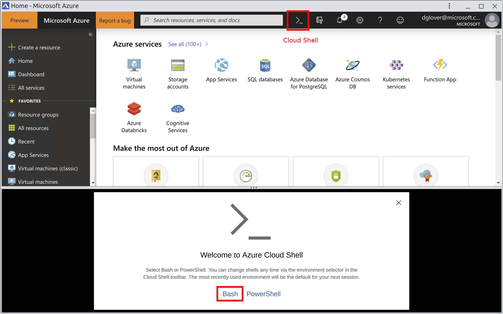
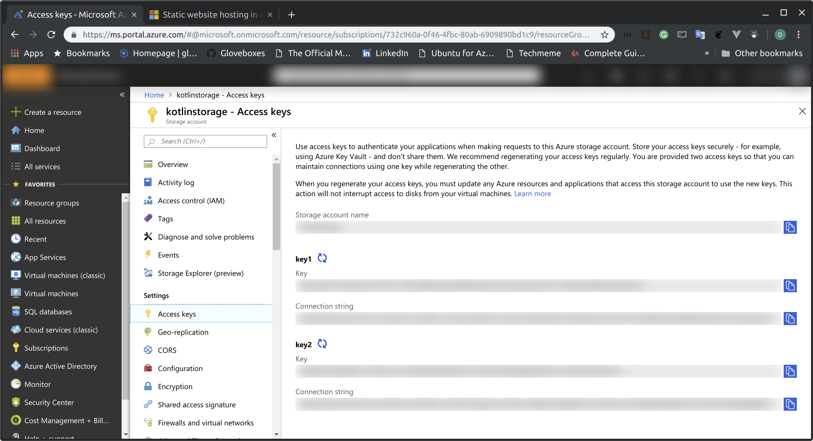
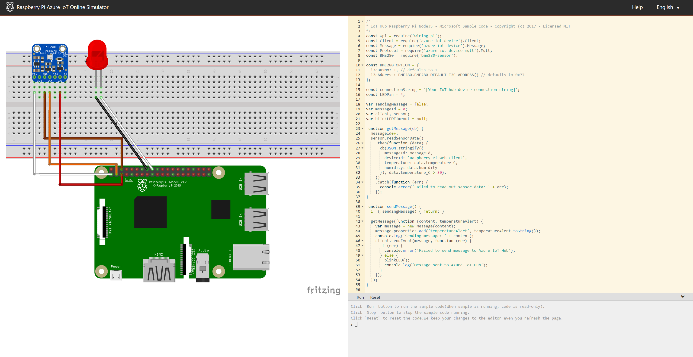

# Creating an IoT Solution with Kotlin Azure Functions

|Author|[Dave Glover](https://developer.microsoft.com/en-us/advocates/dave-glover), Microsoft Cloud Developer Advocate |
|----|---|
|Documentation|[README]()|
|Platform|[Azure IoT Hub](https://docs.microsoft.com/en-us/azure/iot-hub/?WT.mc_id=article-github-dglover), [Azure Functions](https://docs.microsoft.com/en-us/azure/azure-functions/?WT.mc_id=article-github-dglover), [SignalR](https://azure.microsoft.com/en-us/services/signalr-service/?WT.mc_id=article-github-dglover), [Raspberry Pi Simulator](https://azure-samples.github.io/raspberry-pi-web-simulator/)|
|Video Training|[Azure Serverless end-to-end with Functions, Logic Apps, and Event Grid](https://channel9.msdn.com/Blogs/Azure/Azure-Serverless-end-to-end-with-Functions-Logic-Apps-and-Event-Grid?term=azure%20functions&lang-en=true/?WT.mc_id=article-github-dglover)|
|Date|As at March 2019|

## Solution Overview

The following diagram is a typical IoT solution. The boxes **highlighted in blue** are the areas covered in this walk through as this focuses on extending Azure IoT Hub with serverless Azure Functions written in Kotlin, updating a Device State table and driving simple web data visualisation app via the Azure SignalR Service.



## Set up Requirements


This article shows you:

- How to create a [serverless](https://azure.microsoft.com/overview/serverless-computing/) function project written in Kotlin with IntelliJ IDEA and Apache Maven
- Steps for testing and debugging the function in the integrated development environment (IDE) on your own computer
- Instructions for deploying the function project to Azure Functions

<!-- TODO  -->


## Set up your development environment

To develop a function with Java and IntelliJ, install the following software:

- [Java Developer Kit](https://www.azul.com/downloads/zulu/) (JDK), version 8
- [Apache Maven](https://maven.apache.org), version 3.0 or higher
- [IntelliJ IDEA](https://www.jetbrains.com/idea/download), Community or Ultimate versions with Maven
- [Azure CLI](https://docs.microsoft.com/cli/azure)

> IMPORTANT
>
> The JAVA_HOME environment variable must be set to the install location of the JDK to complete the steps in this article.

## Create an Azure IoT Hub and stream Telemetry

Referenced from [az iot hub](https://docs.microsoft.com/en-us/cli/azure/iot/hub?view=azure-cli-latest)

### STEP 0: Sign in to your Azure Subscription

If you don't have an [Azure subscription](https://docs.microsoft.com/azure/guides/developer/azure-developer-guide#understanding-accounts-subscriptions-and-billing), create a [free account](https://azure.microsoft.com/free/?ref=microsoft.com&utm_source=microsoft.com&utm_medium=docs&utm_campaign=visualstudio) before you begin.

> STUDENTS
>
> If you are a student then signup with [Azure for Students](https://azure.microsoft.com/en-us/free/students/). No credit card is required

### STEP 1: Start the Azure Cloud Shell

From the Azure Portal start the Cloud Shell (Highlighted in RED)

 select Bash

### STEP 2: Select Bash

### STEP 3: Create a Resource Group

Copy and paste the following command into the Bash Cloud Shell

```bash
az group create -l westus -n KotlinResourceGroup
```

### STEP 4: Create an Azure IoT Hub Called MyIotHub

Copy and paste the following command to create a free instance of Azure IoT Hub (Note, you can have only one free IoT Hub per subscription)

```bash
az iot hub create --resource-group KotlinResourceGroup --name MyIotHub --sku F1 --location westus --partition-count 4
```

### STEP 5: Create an Azure IoT Hub Consumer Group

```bash
az iot hub consumer-group create --hub-name MyIotHub --name telemetry-processor
```

### STEP 6: Create an Azure Storage Account

```bash
az storage account create -n kotlinstorage -g KotlinResourceGroup -l westus --sku Standard_LRS --kind StorageV2
```

### STEP 7: Get the newly created Storage Account Connection String



### STEP 8: Create the DeviceState Storage Table

```bash
az storage table create --name DeviceState --connection-string "<kotlinstorage connection string>"
```

### STEP 9: Create the Calibration Storage Table

```bash
az storage table create --name Calibration --connection-string "<kotlinstorage connection string>"
```

### STEP 10: Enable Azure Storage Static Websites

https://docs.microsoft.com/en-us/azure/storage/blobs/storage-blob-static-website


```bash
az storage blob service-properties update --account-name kotlinstorage --static-website --index-document index.html
```

### STEP 11: Upload Static Website Content

```bash
az storage blob upload-batch -s <SOURCE_PATH> -d \$web --account-name <ACCOUNT_NAME>
```

### STEP 12: Create SignalR Service

```
az signalr create --name SignalrService --resource-group KotlinResourceGroup --sku Free_DS2 --location westus
```

Follow these instructions: [Connect a Raspberry Pi online simulator to Azure IoT Hub](https://docs.microsoft.com/en-us/azure/iot-hub/iot-hub-raspberry-pi-web-simulator-get-started)



## Devices

### MXChip

If you have an MXChip Device then follow the [Connect IoT DevKit AZ3166 to Azure IoT Hub](https://docs.microsoft.com/en-us/azure/iot-hub/iot-hub-arduino-iot-devkit-az3166-get-started)


### Other

Also see [getting started with Azure IoT Hub and connecting physical devices](https://docs.microsoft.com/en-us/azure/iot-hub/iot-hub-get-started-physical)

## Create an Azure IoT Hub Consumer Group

## Kotlin Azure Functions

Clone the following GitHub repo

```bash
git clone https://github.com/gloveboxes/iot-ttn-kotlin-azure-functions.git
```

## Open the solution with IntelliJ

1. Open the cloned solution in IntelliJ

## Update the local.settings.json


4. Charting Data

